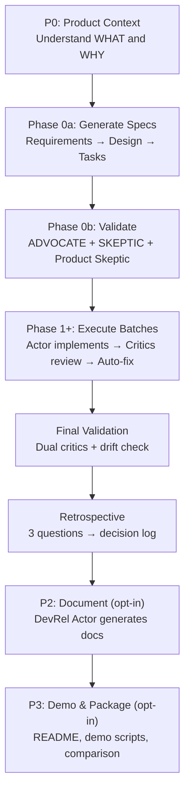
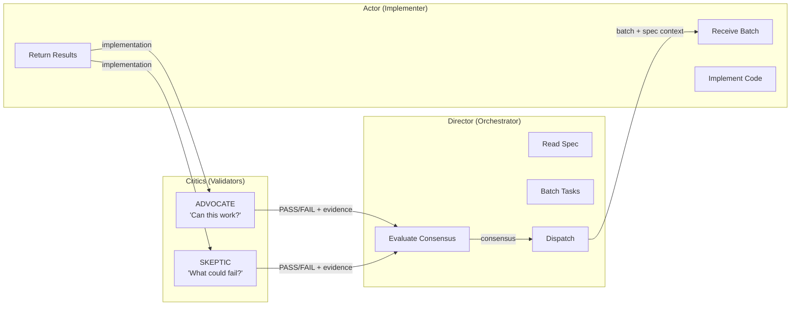
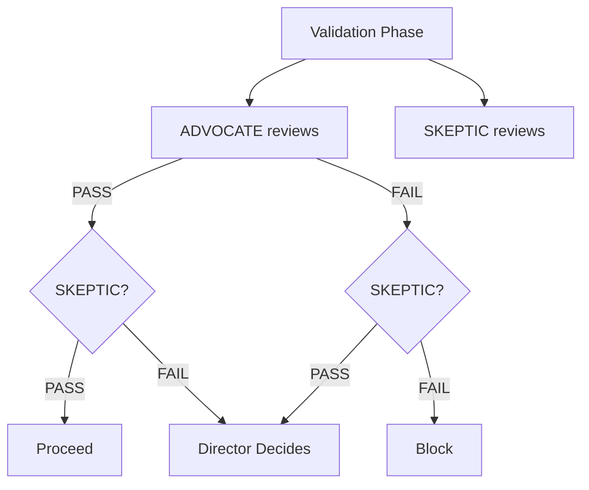
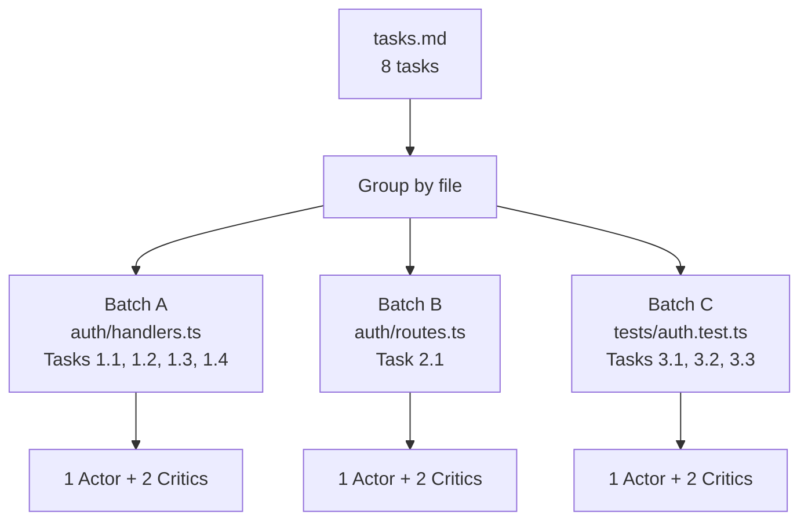
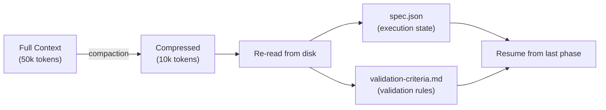
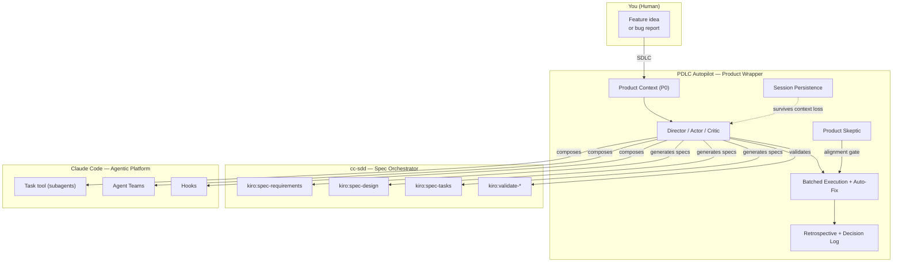

<div align="center">

# PDLC Autopilot

**Autonomous product development lifecycle for Claude Code**

[](https://www.npmjs.com/package/pdlc-autopilot)
[](https://opensource.org/licenses/MIT)
[](https://github.com/gotalab/cc-sdd)
[](https://docs.anthropic.com/en/docs/claude-code)

*You set the direction. The machine handles the rest.*


<br>


</div>

---

## The Philosophy

We are handing more and more control to AI. That's not going to slow down. And the more autonomy we give these systems, the more critical it becomes to have **structure** — not less.

I'm obsessed with creating structure under chaos. Specs before code. Requirements before design. Product context before requirements. Validation at every gate. The boring, disciplined stuff that separates systems that work from systems that happened to work once.

PDLC Autopilot is my opinionated take on what autonomous AI-assisted development should look like. It's my stab at building a self-driving product development agent on top of [Claude Code](https://docs.anthropic.com/en/docs/claude-code) — not by removing process, but by automating it. The human stays in the loop. The human sets direction, defines what "done" looks like, and can intervene at any point. But the orchestration, the quality gates, the fix cycles — that's the machine's job now.

The spec-driven part isn't new — [cc-sdd](https://github.com/gotalab/cc-sdd) already handles structured requirements, design, and task generation. What's missing is the **product development** wrapper: product context before specs, dual-perspective validation, a Product Skeptic that can kill misaligned features, autonomous batched execution with self-correction, and session persistence that survives context loss. That's what PDLC Autopilot adds.

The key insight: **the agent that writes the code should never be the one that reviews it.** Separate Director, Actor, and Critic agents with opposing incentives eliminate self-evaluation bias — the same reason humans do code reviews.

---

## What It Does

PDLC Autopilot is a **self-driving product development pipeline** that covers the entire lifecycle — from product context through implementation to documentation:

- **Starts with product context** — understands *what* to build and *why* before writing a line of code
- **Generates specs automatically** — requirements, design, and tasks in one pass
- **Validates before building** — dual critics (ADVOCATE + SKEPTIC) plus a Product Skeptic catch issues early
- **Batches work intelligently** — groups tasks by file, reducing agent overhead by 77-87%
- **Fixes its own mistakes** — when the SKEPTIC catches a bug, it's fixed automatically
- **Survives context loss** — persists state to disk, resumes after Claude's context window compresses
- **Scales with teams** — 5 parallelization strategies turn sequential work into concurrent execution

---

## Quick Start

**1. Install cc-sdd** (spec orchestrator)
```bash
npx cc-sdd@latest --claude
```

**2. Install PDLC Autopilot** (product lifecycle wrapper)
```bash
npx pdlc-autopilot
```

**3. Describe what you want to build**
```
You: SDLC — build a user authentication system with OAuth support
```

The autopilot kicks in — asks you targeted product context questions, generates specs, validates with dual critics, implements in batches, reviews, fixes, and reports back. You stay in control: you provide the direction, review validation results, and can intervene at any point.

---

## The Product Development Lifecycle

Unlike pure SDLC tools that jump straight to code, PDLC Autopilot wraps the implementation loop with **product phases** — ensuring you build the right thing, not just build the thing right.



### Product Context First (P0)

Every run starts by checking for `product-context.md`. If missing, the autopilot asks you a few targeted questions and generates it. This file captures:

- **Product tier** — how much process is appropriate (hobby project vs production system)
- **Target users** — who benefits and how
- **Success criteria** — what "done" looks like
- **Constraints** — what's off the table

No implementation starts without product context. This prevents building the wrong thing efficiently.

### Three Workflow Paths

Not every task needs the full lifecycle. The autopilot classifies your request and picks the right path:

| Signal | Path | Phases | Agent Calls |
|--------|------|--------|-------------|
| "Build feature", "implement spec" | **Full PDLC** | P0 → Generate → Validate → Execute → Retro | ~10-20 |
| "Bug report", "fix regression" | **Bug Fix** | Diagnose → Fix → SKEPTIC-only validation → Retro | ~2-4 |
| "Add flag", "tweak behavior" | **Iteration** | Mini-spec → Execute → Adaptive validation → Retro | ~4-6 |

All three paths end with a retrospective and decision log. The lightweight paths skip spec generation and use targeted validation instead of the full dual-critic sweep.

---

## Architecture

### Director / Actor / Critic

Three distinct roles prevent self-evaluation bias — the same reason humans do code reviews.



- **Director** reads the spec once, groups tasks into batches, dispatches Actors and Critics, evaluates consensus
- **Actor** receives a batch of tasks (all touching the same files), implements them together, self-reviews
- **Critics** (ADVOCATE + SKEPTIC) independently review from opposing perspectives

> See [docs/agentic-principles.md](docs/agentic-principles.md) for the neuroscience behind role separation.

### Dual Validation

Every review dispatches two critics in parallel. Their verdicts combine via consensus:



| ADVOCATE | SKEPTIC | Result |
|----------|---------|--------|
| PASS | PASS | Proceed |
| FAIL | FAIL | Block — fix issues first |
| PASS | FAIL | Director reviews both reports |
| FAIL | PASS | Director reviews both reports |

When the SKEPTIC catches an issue with file:line evidence, the Actor fixes it automatically — up to 2 fix cycles per batch before escalating to you.

### Product Skeptic

Beyond code validation, the **Product Skeptic** checks alignment with your product context:

- Does this feature serve the stated users?
- Does it match the product tier? (don't over-engineer a hobby project)
- Is scope appropriate? (flag gold-plating, cut unnecessary complexity)

Three verdicts: **APPROVE** (proceed), **SCOPE** (cut specific items, then proceed), **KILL** (blocks execution — misaligned with product goals).

### Intelligent Task Batching

Tasks are grouped by file ownership to minimize agent overhead:



| Scenario | Per-Task Agents | Batched Agents | Savings |
|----------|----------------|----------------|---------|
| 4 tasks, same file | 12 | 2 | 83% |
| 10 tasks, 2 files | 30 | 4 | 87% |
| 10 tasks, 5 files | 30 | 10 | 67% |

### Session Recovery

Long sessions exceed Claude's context window. PDLC Autopilot persists critical state to disk and recovers automatically:



Two files survive compaction: `spec.json` (tracks current phase, last batch, validation results) and `validation-criteria.md` (stores the rules validators check against). No work is lost. No work is repeated.

---

## T-Mode: Parallel Teams

> **Preview Feature:** Requires `CLAUDE_CODE_EXPERIMENTAL_AGENT_TEAMS=1`. PDLC Autopilot works fully without it.

When Agent Teams is enabled, the Director spawns parallel teammates within batches. It analyzes the task graph and selects the right strategy:

| Strategy | Team Shape | Parallelism | Best For |
|----------|-----------|-------------|----------|
| S1: File Ownership | N teammates, each owns files | Maximum | Independent modules |
| S2: Impl + Test | Builder + Tester pair | Medium | Quality-focused features |
| S3: Full Triad | Builder + Tester + Product | Medium | User-facing features |
| S4: Pipeline | Sequential handoff chain | Low (ordered) | Dependent tasks |
| S5: Swarm | Multiple concerns, shared files | High (coordinated) | Complex refactors |

You don't configure teams manually. The Director analyzes the task graph and picks. You can override if you want.

> See [docs/t-mode-strategies.md](docs/t-mode-strategies.md) for detailed diagrams and selection flowchart.

---

## Before vs After

<table>
<tr>
<th>cc-sdd alone (7+ commands)</th>
<th>Wrapped with PDLC Autopilot</th>
</tr>
<tr>
<td>

```
You: /kiro:spec-requirements
You: (review requirements)
You: /kiro:spec-design
You: (review design)
You: /kiro:spec-tasks
You: (review tasks)
You: Implement task 1.1
You: Implement task 1.2
You: Now review everything
You: Fix the issue
You: Review again
```

7+ commands. Manual phase transitions. You babysit every step.

</td>
<td>

```
You: SDLC — add rate limiting to the API
```

One trigger. You provide the direction and review key decisions. The autopilot handles spec generation, validation, batched implementation, dual-critic review, and auto-fix cycles.

</td>
</tr>
</table>

---

## Installation

### Via npm (recommended)

```bash
# Global install (works across all projects)
npx pdlc-autopilot

# Project-level install (version-pinned per repo)
npx pdlc-autopilot --project
```

### Manual install

```bash
git clone https://github.com/vishnujayvel/pdlc-autopilot.git
mkdir -p ~/.claude/skills/pdlc-autopilot
cp pdlc-autopilot/templates/skills/pdlc-autopilot/SKILL.md ~/.claude/skills/pdlc-autopilot/
```

### CLI flags

| Flag | Description |
|------|-------------|
| `--project` | Install to `.claude/skills/` (project-level) instead of global |
| `--yes`, `-y` | Skip confirmation prompts |
| `--dry-run` | Show what would be installed without writing files |
| `--version`, `-v` | Print version |
| `--help`, `-h` | Print usage |

---

## Prerequisites

- [Claude Code CLI](https://docs.anthropic.com/en/docs/claude-code) — the runtime environment
- [cc-sdd](https://github.com/gotalab/cc-sdd) >= 2.0.0 — provides Kiro spec commands

```bash
npx cc-sdd@latest --claude
```

---

## FAQ

**Do I need to learn the 5 team strategies?**

No. The Director picks based on your task structure. Most users never think about it.

**What if I don't have cc-sdd?**

The installer warns you. One command: `npx cc-sdd@latest --claude`.

**Can I use it on existing specs?**

Yes. It detects existing artifacts and picks up where you left off.

**What if the critics disagree?**

The Director reviews both reports. SKEPTIC findings with file:line evidence are almost always valid.

**What is `validation-criteria.md`?**

An optional file defining project-specific validation rules. It survives context compaction, so validators always have access. See `examples/validation-criteria-template.md`.

---

## Documentation

| Document | Description |
|----------|-------------|
| [Architecture Deep Dive](docs/architecture.md) | Director/Actor/Critic internals, consensus engine, task batching, session persistence |
| [Agentic Principles](docs/agentic-principles.md) | Why role separation works, opposing incentives, how Claude Code primitives compose |
| [PDLC Lifecycle](docs/pdlc-lifecycle.md) | All phases (P0-P3), lightweight paths, context health, retrospectives |
| [T-Mode Strategies](docs/t-mode-strategies.md) | All 5 strategies with diagrams, selection flowchart, team coordination |

---

## Hooks (Included)

Three opt-in hooks add deterministic quality gates to the PDLC loop. They work with Claude Code's native hook system — add them to your `.claude/settings.json` to activate.

| Hook | Event | What It Does |
|------|-------|-------------|
| `pdlc-stop-check.sh` | `Stop` | Prevents Claude from exiting when tasks are still pending. Counts `- [ ]` items in tasks.md and blocks exit until all are complete. Includes a safety valve (default: 50 continues max). |
| `post-edit-lint.sh` | `PostToolUse` (Write/Edit) | Auto-formats files after Claude edits them. Detects your project's formatter (prettier, ruff, black, gofmt, rustfmt) by walking the directory tree. Fails silently if no formatter found. |
| `post-edit-test.sh` | `PostToolUse` (Write/Edit) | Runs related tests after file modifications. Detects your test framework (vitest, jest, pytest, go test, cargo test), finds the corresponding test file, and runs only that test. Truncates output to 30 lines. |

All hooks exit 0 on failure — they **never block Claude Code**. They're informational quality gates, not hard stops.

Install via: `npx pdlc-autopilot --hooks` (coming soon) or copy from `hooks/` manually.

---

## How It Fits Together

[cc-sdd](https://github.com/gotalab/cc-sdd) is a spec orchestrator in its own right — it generates structured requirements, designs, and tasks via Kiro-style commands. You can use it standalone and run each phase manually.

PDLC Autopilot wraps cc-sdd with the **product development lifecycle** — the parts that turn spec-driven development into an autonomous pipeline:



| What | Tool | Does |
|------|------|------|
| **Spec generation** | [cc-sdd](https://github.com/gotalab/cc-sdd) | Requirements, design, tasks — works standalone or called by PDLC Autopilot |
| **Product wrapper** | PDLC Autopilot | Product context, dual validation, Product Skeptic, batching, auto-fix, session recovery |
| **Agentic platform** | [Claude Code](https://docs.anthropic.com/en/docs/claude-code) | Task tool, skills, hooks, agent teams — the runtime everything runs on |

cc-sdd works without PDLC Autopilot. PDLC Autopilot calls cc-sdd internally when specs need generating. T-Mode is optional on top of both.

---

## Compatibility

| pdlc-autopilot | cc-sdd | Claude Code |
|---------------|--------|-------------|
| 1.0.x | >= 2.0.0 | Jan 2026+ |
| 1.1.x | >= 2.0.0 | Jan 2026+ |

---

## Acknowledgments

PDLC Autopilot builds on [cc-sdd](https://github.com/gotalab/cc-sdd) by the Kiro spec community. cc-sdd is the spec orchestrator that makes structured AI-assisted development possible in Claude Code — PDLC Autopilot wraps it with product development lifecycle automation. Thank you to the cc-sdd maintainers and contributors.

---

## License

[MIT](LICENSE)
