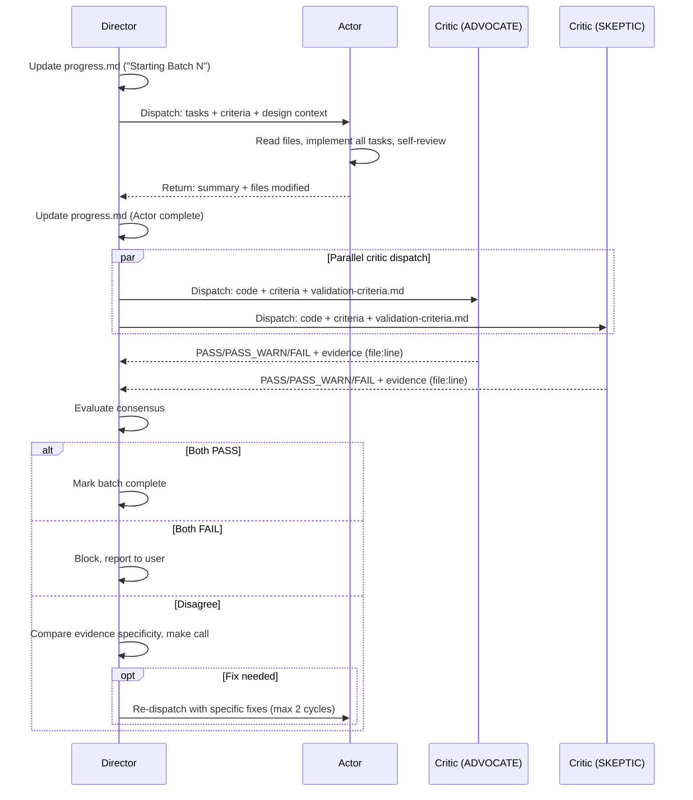
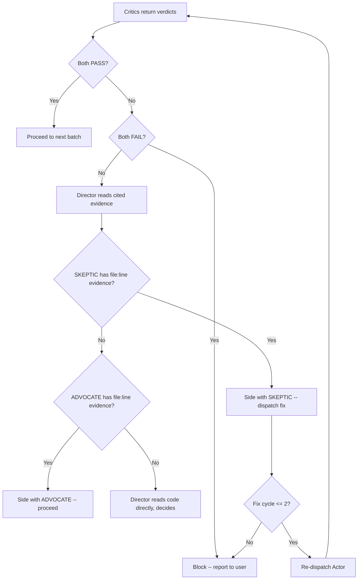
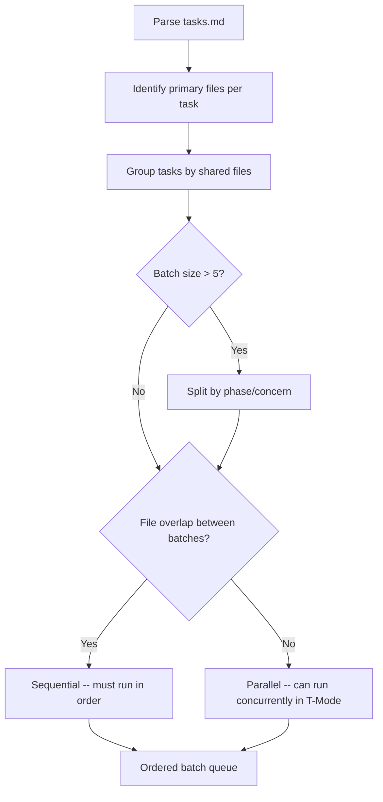
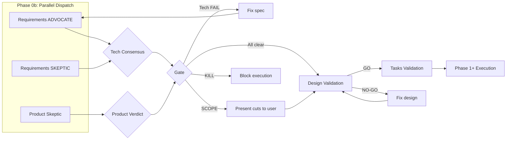
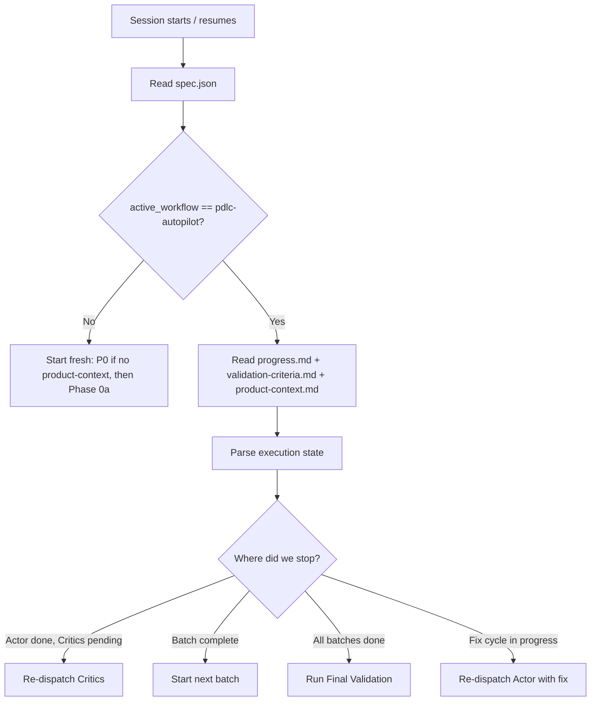
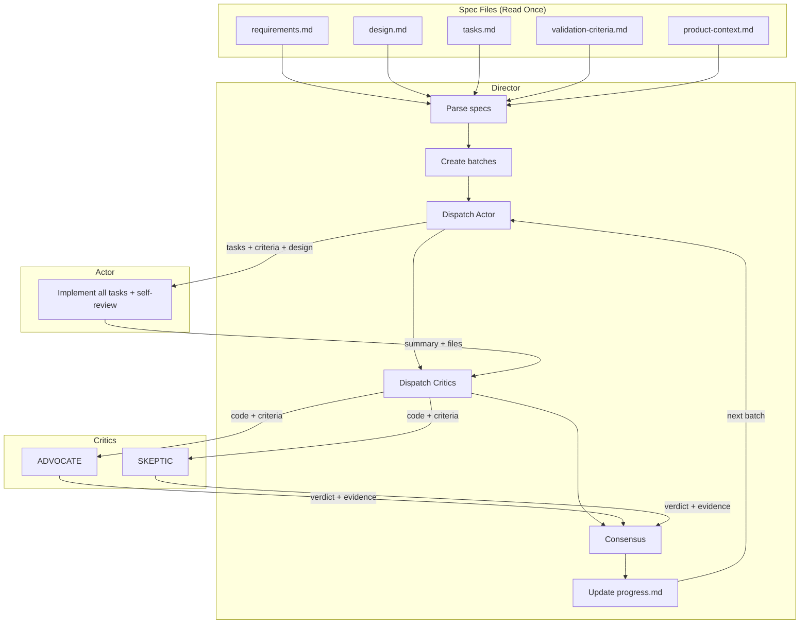

# PDLC Autopilot -- Architecture Deep Dive

This document describes the internal architecture of PDLC Autopilot, an autonomous product development lifecycle orchestrator built as a Claude Code skill. It is intended for developers who want to understand how the system works under the hood, extend it, or build similar agentic workflows.

---

## System Overview

PDLC Autopilot is a Claude Code skill (defined in `SKILL.md`) that orchestrates spec-driven development through an autonomous loop. It reads structured specifications from `.claude/specs/{feature}/` and drives them to completion using a Director/Actor/Critic pattern.

### Zero Custom Infrastructure

The system has no server, no database, no custom runtime. It composes Claude Code's existing agent primitives:

| Primitive | Usage in PDLC Autopilot |
|-----------|------------------------|
| **Task tool** (general-purpose subagent) | Spawns Actor and Critic subagents |
| **Skill tool** | Invokes Kiro skills for spec generation and validation |
| **TeamCreate / SendMessage** | T-Mode parallel teammates (experimental) |
| **TaskList / TaskCreate / TaskUpdate** | Cross-session task persistence and bug tracking |
| **Read / Write / Edit** | File I/O for specs, progress, and source code |

### Spec Directory Structure

```
{project}/.claude/specs/{feature}/
  spec.json                 # State: phase, batch progress, workflow metadata
  requirements.md           # FR-* functional requirements + acceptance criteria
  design.md                 # Technical design, data models, interfaces
  tasks.md                  # Implementation tasks with FR-* mappings
  validation-criteria.md    # Tenet checklists + validator prompts (optional but recommended)
  progress.md               # Execution checkpoint (batch status, critic results, test counts)

{project}/.claude/
  product-context.md        # Product strategy (tier, thesis, MVP scope, kill criteria)
  decision-log.md           # Append-only log of significant product decisions
```

### Three Workflow Paths

Before any work begins, the system classifies the request:

| Path | Trigger | Agent Calls | Artifacts |
|------|---------|-------------|-----------|
| **Full PDLC** | "Build feature", "implement spec" | 10-30 | requirements.md, design.md, tasks.md |
| **Bug Fix** | "PDLC bug fix", "regression" | ~2 | progress.md only |
| **Iteration** | "Iterate", "add flag", "tweak" | ~4-6 | Mini-spec in progress.md |

All three paths share: context health check, phase visualization, retrospective, and decision logging.

---

## Director / Actor / Critic Pattern

The Director is the main Claude session. Actors and Critics are subagents spawned via the Task tool.

### Director (Main Claude Session)

The Director never implements code directly. Its responsibilities:

1. **Read spec once** -- parse all spec files into memory at session start. Never re-read within a session (re-read on recovery after compaction).
2. **Group tasks into batches** -- cluster by file ownership to minimize agent calls.
3. **Dispatch Actors** -- one Actor per batch with all tasks, criteria, and design context.
4. **Dispatch Critics** -- two Critics (ADVOCATE + SKEPTIC) in parallel after each Actor.
5. **Evaluate consensus** -- apply rules to determine pass/fail/disagree.
6. **Manage fix cycles** -- re-dispatch Actor with specific fixes if needed (max 2 per batch).
7. **Persist state** -- update `spec.json` and `progress.md` after every batch.

### Actor (Task Tool Subagent)

Receives a batch of tasks and implements them all in one pass:

- Reads target files once, plans all changes together, then implements.
- Performs self-review against all acceptance criteria before returning.
- **Never dispatches sub-agents** -- sub-agents inside an Actor defeat batching.
- One Actor per batch, not one per task.

### Critic (Task Tool Subagent)

Two Critics review every batch in parallel with opposing perspectives:

- **ADVOCATE**: "Can this work?" Looks for evidence criteria ARE met. Cites `file:line` as positive evidence.
- **SKEPTIC**: "What could fail?" Hunts for gaps, edge cases, missing logic. Cites `file:line` as negative evidence.

### Batch Execution Sequence



---

## Consensus Engine

The consensus engine combines ADVOCATE and SKEPTIC verdicts. The Director weighs evidence specificity, not just vote counts.

### Decision Table

| ADVOCATE | SKEPTIC | Director Action |
|----------|---------|-----------------|
| PASS | PASS | Proceed to next batch |
| PASS | PASS_WARN | Proceed, log warnings |
| FAIL | FAIL | Block. Report to user. |
| PASS | FAIL | Director reviews evidence, decides |
| FAIL | PASS | Director reviews evidence, decides |

### Disagreement Resolution

When Critics disagree, the Director resolves by comparing evidence quality:

1. **SKEPTIC findings with `file:line` evidence are almost always valid.** A SKEPTIC citing "line 42 of cache.py has no TTL check" presents verifiable evidence.
2. **ADVOCATE findings without specifics are weaker.** General approval does not outweigh specific evidence.
3. **The Director reads the cited lines** to verify before deciding.

In practice, specific SKEPTIC evidence consistently wins over general ADVOCATE approval.

### Consensus Flowchart



---

## Task Batching Engine

Instead of spawning one agent per task (3 agents each), the system groups tasks by shared files and processes them as a single unit.

### Grouping Algorithm



### Savings Math

| Approach | Formula | Agent Calls |
|----------|---------|-------------|
| Per-task | N tasks x 3 agents | 3N |
| Batched | B batches x 3 agents | 3B (where B << N) |

**Production examples:**

| Scenario | Tasks | Batches | Per-Task | Batched | Savings |
|----------|-------|---------|----------|---------|---------|
| 4 tasks, same file | 4 | 1 | 12 | 3 | 75% |
| 10 tasks, 2 files | 10 | 2 | 30 | 6 | 80% |
| 10 tasks, 5 files | 10 | 5 | 30 | 15 | 50% |
| 8 tasks, 3 groups | 8 | 3 | 24 | 9 | 62.5% |

Additional token savings: Actor reads files once for ALL tasks; Critic reads once for ALL criteria; Director reads spec once per session.

### T-Mode: Parallel Teammates

When `CLAUDE_CODE_EXPERIMENTAL_AGENT_TEAMS=1` is set, the Director can spawn multiple teammates to parallelize work within a batch. Five strategies are available:

| Strategy | Description | Best For |
|----------|-------------|----------|
| S1: File Ownership | One teammate per file group | 3+ independent file groups |
| S2: Impl + Test | Implementer + Test Writer | Clear interfaces, TDD |
| S3: Full Triad | Impl + Test + Product Eye | Evolving specs, discovery |
| S4: Pipeline | Staggered handoff | Natural dependency chains |
| S5: Swarm | Multiple concerns, same file | Single complex file |

---

## Validation Pipeline

Validation runs at three levels: spec (before implementation), per-batch (during), and final (after).

### Phase 0b -- Spec Validation



Sequence: (1) Requirements ADVOCATE + SKEPTIC + Product Skeptic run in parallel. (2) Gap analysis via `kiro:validate-gap` (non-blocking). (3) Design validation via `kiro:validate-design` (GO/NO-GO). (4) Tasks ADVOCATE + SKEPTIC in parallel.

### Product Skeptic: 4-Lens Analysis

Checks spec alignment against `product-context.md` through four lenses:

| Lens | Question | Red Flags |
|------|----------|-----------|
| **Build Trap** | Solving a real pain point? | Architecturally elegant but user-invisible |
| **Audience Alignment** | Serves target persona? | Enterprise features in a personal tool |
| **MVP Hydration** | V1 Core scope? | Layer 2/3 features creeping in |
| **Kill Criteria** | Kill criterion triggered? | Building for a dead product |

Verdicts: `APPROVE` (proceed), `SCOPE` (cut bloat, then proceed), `KILL` (block; user can override). Scrutiny scales with tier -- light for Tier 0 Personal, strict for Tier 2 Enterprise.

### Validation Subagent Matrix

| Step | Validators | Parallel | Blocks? |
|------|-----------|----------|---------|
| Requirements | ADVOCATE + SKEPTIC + Product Skeptic | 3 | Yes (BOTH FAIL or KILL) |
| Gap Analysis | kiro:validate-gap | 1 | Warnings only |
| Design | kiro:validate-design | 1 | Yes (NO-GO) |
| Tasks | ADVOCATE + SKEPTIC | 2 | Yes (BOTH FAIL) |
| Per-Batch | ADVOCATE + SKEPTIC | 2 | Yes (BOTH FAIL) |
| Final | ADVOCATE + SKEPTIC (with PDLC compliance built in) | 2 | Reports gaps |
| P2 Docs | Docs Critic | 1 | Opt-in only |

### Final Validation

After all batches: ADVOCATE confirms every FR-* has `file:line` evidence. SKEPTIC hunts uncovered requirements. PDLC compliance verifies deferred requirements (Layer 2/3) were NOT built. Drift check compares implementation against `product-context.md`.

---

## Session Persistence and Recovery

Long sessions hit conversation compaction. The persistence system ensures full continuity through file-based checkpoints.

### Persistent Files

| File | Purpose | Update Frequency |
|------|---------|-----------------|
| `spec.json` | Phase, batch count, workflow metadata | After each batch |
| `validation-criteria.md` | Tenet checklists, validator prompts | Once during setup |
| `progress.md` | Batch status, critic results, test counts, next steps | After every event |
| `product-context.md` | Product strategy, tier, scope | Created at P0; updated during retrospective if needed |
| `decision-log.md` | Significant decisions (append-only) | When decisions occur |

### Save-Before-Dispatch Pattern

```
BEFORE dispatching any batch:
  1. Update progress.md with current state
  2. Dispatch Actor
  3. Actor returns --> update progress.md
  4. Dispatch Critics
  5. Critics return --> update progress.md
  6. Move to next batch
```

Context budget mitigation: lean result handling (summaries only, no full agent output in conversation), checkpoint before heavy operations, proactive saves every 2 batches.

### Recovery Protocol



The "Next Steps" field in `progress.md` is the single most critical recovery signal -- it tells the Director exactly what to do without re-analyzing the session.

---

## State Machine

### Full PDLC State Diagram

```mermaid
stateDiagram-v2
    [*] --> P0_Context: product-context.md missing
    [*] --> Phase0a: product-context.md exists

    state "P0: Product Context" as P0_Context {
        [*] --> AskTier
        AskTier --> AskQuestions
        AskQuestions --> WriteContext
        WriteContext --> [*]
    }
    P0_Context --> Phase0a

    state "Phase 0a: Artifact Generation" as Phase0a {
        [*] --> CheckArtifacts
        CheckArtifacts --> GenerateMissing: missing
        CheckArtifacts --> [*]: all exist
        GenerateMissing --> [*]
    }
    Phase0a --> Phase0b

    state "Phase 0b: Spec Validation" as Phase0b {
        [*] --> ParallelValidation
        ParallelValidation --> Gate
        Gate --> DesignValidation: clear
        Gate --> FixSpec: tech FAIL
        FixSpec --> ParallelValidation
        Gate --> ApplyCuts: SCOPE
        ApplyCuts --> DesignValidation
        Gate --> Blocked: KILL
        DesignValidation --> TaskValidation: GO
        DesignValidation --> FixDesign: NO-GO
        FixDesign --> DesignValidation
        TaskValidation --> [*]: PASS
    }
    Phase0b --> Execution

    state "Phase 1+: Batch Execution" as Execution {
        [*] --> NextBatch
        NextBatch --> DispatchActor
        DispatchActor --> DispatchCritics
        DispatchCritics --> Consensus
        Consensus --> NextBatch: PASS + more batches
        Consensus --> FixCycle: FAIL
        FixCycle --> DispatchActor: cycle <= 2
        FixCycle --> Blocked2: cycle > 2
        Consensus --> [*]: PASS + last batch
    }
    Execution --> FinalValidation

    state "Final + Retro" as FinalValidation {
        [*] --> FinalCritics
        FinalCritics --> DriftCheck
        DriftCheck --> Retrospective
        Retrospective --> [*]
    }
    FinalValidation --> P2_Docs: user requests
    FinalValidation --> Complete: done

    state "P2: Document" as P2_Docs
    state "P3: Demo & Package" as P3_Launch
    P2_Docs --> P3_Launch: user requests
    P2_Docs --> Complete
    P3_Launch --> Complete
    Complete --> [*]
```



### Lightweight Paths

**Bug Fix** (4 phases, ~2 agent calls): `Diagnose -> Fix -> Validate (SKEPTIC only) -> Retro`. Max 1 fix cycle. No ADVOCATE or Product Skeptic.

**Iteration** (4 phases, ~4-6 calls): `Mini-Spec -> Execute -> Validate (adaptive) -> Retro`. Dual critics if >= 3 criteria, SKEPTIC only if < 3. Includes alignment check against MVP scope.

---

## Data Flow

### Director to Actor

| Data | Source |
|------|--------|
| Task descriptions + acceptance criteria | tasks.md (batch subset) |
| Design context (models, interfaces) | design.md (relevant sections) |
| File paths to modify | Derived from task analysis |
| Validation criteria + tenet checklist | validation-criteria.md |
| Instructions: read once, plan together, self-review, no sub-agents | Hardcoded in prompt template |

### Actor to Director

| Data | Content |
|------|---------|
| Implementation summary | What changed and why, files created/modified |
| Self-review notes | Which criteria verified, concerns/trade-offs |
| Task completion status | Per-task: done / partial / blocked |

### Director to Critics

Both ADVOCATE and SKEPTIC receive identical inputs with role-specific instructions:

| Data | Content |
|------|---------|
| Implementation code | All files modified (full contents, not diffs) |
| Acceptance criteria | All criteria from all tasks in batch |
| Validation criteria | Tenet checklist + phase-specific checks |
| Role instruction | ADVOCATE: "find reasons it IS correct" / SKEPTIC: "find gaps" |

### Critics to Director

| Data | Content |
|------|---------|
| Verdict | PASS / FAIL / PASS_WARN |
| Evidence list | file:line references + descriptions |
| Severity | Critical (blocks) / Warning (non-blocking) / Info |
| FR-* report | ADVOCATE: IDs verified / SKEPTIC: IDs at risk |
| Tenet report | ADVOCATE: tenets verified / SKEPTIC: tenets violated |

### End-to-End Data Flow



---

## Appendix: Key Design Decisions

**Why dual Critics?** A single critic develops confirmation bias. The ADVOCATE prevents false negatives (rejecting correct code). The SKEPTIC prevents false positives (accepting broken code). Disagreements surface the most valuable findings.

**Why batching?** Per-task agents cause context duplication (each re-reads files), coordination overhead (conflicting changes), token waste (3N agents), and edit conflicts. Batching eliminates all four: one Actor reads once, implements coherently; one pair of Critics checks everything together.

**Why file-based persistence?** Conversation compaction happens regularly in sessions with 6+ batches. File persistence requires no infrastructure, is human-readable, is version-controlled, and enables deterministic recovery (read four files, resume from exact position).
