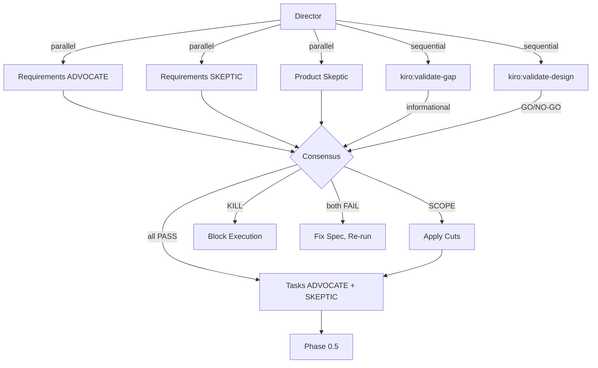

# PDLC Lifecycle Reference

Complete reference for every phase, path, and protocol in the PDLC Autopilot -- an autonomous product development lifecycle tool orchestrated by the Director/Actor/Critic pattern inside Claude Code.

---

## 1. Lifecycle Overview

The system supports three execution paths. All share a context health check on entry and a retrospective on exit.

```mermaid
flowchart TD
    Start([User Request]) --> Router{Workflow Router}

    Router -->|"bug, fix, broken"| BugFix
    Router -->|"add, tweak, iterate"| Iteration
    Router -->|"build, feature, spec"| FullPDLC
    Router -->|Ambiguous| Ask[Ask User] --> Router

    subgraph FullPDLC [Full PDLC Path]
        direction LR
        P0[P0: Product Context] --> A0a[0a: Auto-Gen Artifacts]
        A0a --> A0b[0b: Dual Validation]
        A0b --> A05[0.5: Load Criteria]
        A05 --> A1[1+: Batch Execution]
        A1 --> Fin[Final Validation]
        Fin --> Ret[Retrospective]
        Ret -.->|opt-in| P2[P2: Document]
        P2 -.->|opt-in| P3[P3: Demo]
    end

    subgraph BugFix [Bug Fix Path]
        direction LR
        B1[B1: Diagnose] --> B2[B2: Fix] --> B3[B3: Validate] --> B4[B4: Retro]
    end

    subgraph Iteration [Iteration Path]
        direction LR
        I1[I1: Mini-Spec] --> I2[I2: Execute] --> I3[I3: Validate] --> I4[I4: Retro]
    end

    style FullPDLC fill:#e8f5e9,stroke:#2e7d32
    style BugFix fill:#fff3e0,stroke:#ef6c00
    style Iteration fill:#e3f2fd,stroke:#1565c0
```



```
Full PDLC:  P0 -> 0a -> 0b -> 0.5 -> 1+ -> Final -> Retro -> P2 -> P3
Bug Fix:    B1 (Diagnose) -> B2 (Fix) -> B3 (Validate) -> B4 (Retro)
Iteration:  I1 (Mini-Spec) -> I2 (Execute) -> I3 (Validate) -> I4 (Retro)
```

---

## 2. Workflow Router

Classifies every request before any work begins.

| Signal Words | Path | Agent Calls |
|---|---|---|
| `bug`, `fix`, `broken`, `regression`, `error` | **Bug Fix** | ~2 |
| `add`, `tweak`, `iterate`, `enhance`, `config` | **Iteration** | ~4-6 |
| `build`, `feature`, `implement`, `spec` | **Full PDLC** | ~10-30 |
| Ambiguous | Ask: "Bug fix, iteration, or new feature?" | -- |

**Stickiness gate:** Lightweight paths activate only with explicit PDLC context (e.g., "PDLC bug fix"). A plain "fix this bug" stays in normal Claude Code mode.

**Shared across all paths:** context health check, phase visualization, retrospective, decision log, session persistence via `progress.md` and `spec.json`.

---

## 3. Phase P0: Product Context (MANDATORY)

**Purpose:** Understand WHAT to build and WHY before writing code.

**Trigger:** Runs if `{project}/.claude/product-context.md` does not exist. If it exists, load it, extract the tier, and skip to Phase 0a.

### Generation Protocol

```
1. Ask user: "What audience tier?" (T0 Personal / T1 Community / T2 Enterprise)
2. Ask targeted questions based on tier (2-6 depending on tier):
   ALL:  "What problem does this solve?" / "What must V1 do well?"
   T1+:  "Who are alternatives?" / "What would make you stop?"
   T2:   "Success metrics?" / "Go-to-market motion?"
3. Generate product-context.md (8 sections: Core Thesis, Audience & Tier,
   MVP Scope, Feature Philosophy, Kill Criteria, Competitive Positioning, Principles, Decision History)
4. Show to user for confirmation, then proceed
```

The file includes `<!-- last_reviewed: YYYY-MM-DD -->` for freshness tracking. Lives at `{project}/.claude/product-context.md` (project-level, not per-spec).

---

## 4. Phase 0a: Auto-Generate Artifacts

**Purpose:** Ensure `requirements.md`, `design.md`, and `tasks.md` exist before validation.

```
1. requirements.md missing? -> invoke kiro:spec-requirements
2. design.md missing?       -> invoke kiro:spec-design -y
3. tasks.md missing?        -> invoke kiro:spec-tasks -y
4. Kiro command fails?      -> "Install cc-sdd: npx cc-sdd@latest --claude" -> STOP
5. All exist               -> proceed to Phase 0b
```

The Director auto-generates missing artifacts. It never asks the user to run commands manually. Existing artifacts are not regenerated.

---

## 5. Phase 0b: Dual-Perspective + Product Skeptic Validation

**Purpose:** Gate between planning and execution. No code is written until all artifacts pass.



| Step | Validators | Blocks? |
|---|---|---|
| Requirements | ADVOCATE + SKEPTIC + Product Skeptic (3 parallel) | Yes if ADVOCATE+SKEPTIC both FAIL, or Product Skeptic KILL |
| Gap Analysis | `kiro:validate-gap` | Warnings only |
| Design | `kiro:validate-design` | Yes, GO/NO-GO |
| Tasks | ADVOCATE + SKEPTIC (2 parallel) | Yes if both FAIL |

### Product Skeptic

Evaluates specs through 4 lenses: **Build Trap** (real pain point?), **Audience Alignment** (right persona?), **MVP Hydration** (Layer 2/3 creep?), **Kill Criteria** (should we stop?).

| Verdict | Meaning | Action |
|---|---|---|
| `APPROVE` | Aligned with product context | Proceed |
| `SCOPE` | Spec is 80%+ bloat -- cut to core | Present cuts, apply confirmed ones, proceed |
| `KILL` | Fundamentally misaligned | Block. User can override, revise, or accept. |

Scrutiny scales with tier: T0 = light (usually APPROVE), T1 = standard, T2 = strict (SCOPE common).

---

## 6. Phase 0.5: Load Validation Criteria

**Purpose:** Load `{spec_dir}/validation-criteria.md` as the single source of truth for "what does valid mean?"

Contains phase checklists, tenet compliance rules, and custom validator prompts. Its content is injected into every subsequent validator prompt. If missing, validators use defaults. This file survives context compaction -- the Director re-reads it on resume.

---

## 7. Phase 1+: Batch Execution

**Purpose:** Implement all tasks in batches with dual-critic review per batch.

### Batching

Group tasks by file. If batch > 5 tasks, split by phase. Batches with no file overlap can run in parallel.

### Per-Batch Loop

```
1. Update progress.md: "Starting Batch X"
2. Collect tasks, acceptance criteria, design context
3. T-Mode? -> team strategy. Standard? -> single Actor subagent
4. Actor implements -> update progress.md
5. Dispatch ADVOCATE + SKEPTIC Critics (parallel)
6. Consensus: both PASS -> done. Both FAIL -> fix cycle (max 2). Disagree -> Director resolves.
7. Mark batch complete. Update visualization. Next batch.
```

The Director keeps context lean: extract only summaries from subagent output, write details to `progress.md`. After each batch, update `progress.md` with batch status, test counts, and critic results. The `spec.json` stores only high-level state (current_phase, validation_results) -- batch-level progress lives in `progress.md`.

---

## 8. Final Validation

**Purpose:** Verify the entire implementation is correct, complete, and aligned with product context.

```
1. ADVOCATE Final Validator (parallel) -- evidence each FR-* IS covered + PDLC compliance
2. SKEPTIC Final Validator (parallel)  -- evidence each FR-* is NOT covered + PDLC violations
3. PDLC Compliance (in both prompts):
   - MVP scope adherence: deferred requirements (Layer 2/3) were NOT implemented
   - Product principles from product-context.md are respected
   - Kill criteria not triggered
   - Scope cuts (if Product Skeptic issued SCOPE) were respected
4. Drift Check (in both prompts):
   - Compare implementation vs. product-context.md
   - INTENTIONAL drift (in decision-log.md) -> note
   - UNINTENTIONAL drift -> flag for retrospective
   - SCOPE CREEP (not in V1 Core or Layer 2) -> flag for Product Skeptic
5. Generate final report: alignment, batches, tests, verdicts, drift, files modified
```

---

## 9. Retrospective

**Purpose:** Capture learnings. Runs at the end of every path. Target: ~30 seconds.

### Three Questions

1. **What changed?** Actual outcome vs. expected (scope cuts, unexpected complexity)
2. **What did we learn?** Reusable insight (pattern, mistake, broken assumption)
3. **Should context update?** Does product-context.md need changes?

### Outputs

- Retrospective summary in `progress.md` (always)
- Decision log entry in `{project}/.claude/decision-log.md` (if decision/learning found)
- Updated `<!-- last_reviewed -->` in `product-context.md` (if context reviewed)

Decision log entries record: context, decision, alternatives considered, rationale, PDLC cycle, and product context impact. Append-only, newest first.

---

## 10. Phase P2: Document (Opt-In)

**Trigger:** "document this feature" or "write docs" after Final passes.

```
1. DevRel Actor: reads actual source code, generates docs with file:line citations
   - Tier 0: quick-start, config, limitations
   - Tier 1: getting started, API ref, config ref, examples, FAQ
   - Tier 2: + architecture, security, performance, migration
2. Docs Critic: verifies every citation against the codebase. Flags hallucinations.
3. Fix cycle (max 2): Actor corrects only flagged issues
```

Every documented claim must map to a real `file:line`. The Docs Critic prevents the failure mode of documenting APIs or behaviors that do not exist.

---

## 11. Phase P3: Demo and Package (Opt-In)

**Trigger:** "launch prep" or "demo script" after Final passes.

```
1. Demo Actor: creates launch artifacts by tier
   - Tier 0: README update, usage example
   - Tier 1: + demo script, comparison matrix, CHANGELOG
   - Tier 2: + release notes, migration guide, demo video script
2. Director Validation: runs demo script, spot-checks 3-5 claims against code
3. Fix cycle (max 2)
```

Demo scripts must be runnable end-to-end, demonstrate the V1 core feature, use actual output, and complete in under 2 minutes.

---

## 12. Bug Fix Path (Lightweight)

**When:** Bug reports, regressions, broken behavior + explicit PDLC context. ~2 agent calls (Actor + SKEPTIC).

**B1: Diagnose** -- Director reads code, identifies root cause, updates progress.md. No subagent.

**B2: Fix** -- Actor subagent (or Director for trivial < 5 line fixes). Must include regression test. Deliverables: code fix, regression test, self-review.

**B3: Validate** -- SKEPTIC only (no ADVOCATE, no Product Skeptic). Reviews: root cause addressed? meaningful test? side effects? Max 1 fix cycle.

**B4: Retrospective** -- Same three questions. Decision log entry if reusable learning found.

---

## 13. Iteration Path (Medium Weight)

**When:** Small enhancements, tweaks, adding a flag + explicit PDLC context. ~4-6 agent calls.

**I1: Mini-Spec** -- Director writes inline spec in progress.md: what's changing, acceptance criteria, files affected, alignment check (V1 Core / Layer 2 / New). Warns if outside V1 scope.

**I2: Execute** -- Actor subagent, 1-2 batches max. If 3+ needed, promote to Full PDLC.

**I3: Validate** -- Adaptive: criteria >= 3 -> ADVOCATE + SKEPTIC. Criteria < 3 -> SKEPTIC only. Max 2 fix cycles. Both critics check alignment with mini-spec.

**I4: Retrospective** -- Same three questions.

---

## 14. Context Health Protocol

**Runs on EVERY invocation before any path executes.**

### Freshness Check

```
1. Read product-context.md, extract <!-- last_reviewed: YYYY-MM-DD -->
2. Compare against tier threshold: T0 = 90 days, T1 = 30 days, T2 = 14 days
3. Missing comment -> treat as stale
4. Stale -> WARN (non-blocking), flag for retro
5. Fresh -> silent
6. Always proceed (never blocks)
```

### Decision Log

Append-only at `{project}/.claude/decision-log.md`. Log when: Product Skeptic SCOPE/KILL, retro learning, broken assumption, scope drift, significant trade-off. Do NOT log routine batch completions or standard PASS results.

### Drift Detection

Added to Final Validation prompts. Classifies drift as:

| Type | Description | Action |
|---|---|---|
| INTENTIONAL | In decision-log.md | Note, no action |
| UNINTENTIONAL | No log entry, deviates | Flag for retro |
| SCOPE CREEP | Feature not in V1 Core or Layer 2 | Flag for Product Skeptic |

---

## 15. Phase Visualization

The Director renders unicode progress indicators inline. Updated on skill invocation, phase transition, batch completion, critic completion, and cycle end.

```
PDLC v3.1 -- {feature_name} -- Tier {N}
[P0] -> [0a] -> [0b] -> [>1+] -- [Final] -- [P2] -- [P3]
Progress: [========--------] 4/8 batches
Tests: 156 passing | Critics: ADVOCATE 3/3 | SKEPTIC 3/3
Product Skeptic: APPROVE | Context: fresh
```

Bug Fix and Iteration paths use compact single-line pipelines.

---

## 16. Session Persistence

Long PDLC sessions hit conversation compaction, causing all in-memory state to vanish. Four persistent files ensure continuity:

| File | Location | Purpose |
|---|---|---|
| `product-context.md` | `{project}/.claude/` | Product strategy, tier, kill criteria |
| `decision-log.md` | `{project}/.claude/` | Append-only decisions and learnings |
| `validation-criteria.md` | `{spec_dir}/` | Rules, tenet checklists, custom prompts |
| `progress.md` | `{spec_dir}/` | Batch status, critic results, test counts, next steps |

### progress.md Contents

The execution checkpoint file tracks: execution state (timestamps, test count, current phase), PDLC state (tier, Product Skeptic verdict, P2/P3 status), batch plan table, batch status table with critic results, fixes applied with file:line references, files created/modified, next steps, and retrospective state.

Updated after every significant event: batch completion, critic results, fix applied, new batch start.

### Resume Protocol

```
1. Read spec.json -> get spec_dir, current_phase
2. Read progress.md -> EXACT execution state
3. Read validation-criteria.md -> rules
4. Do NOT re-read completed batch files
5. Resume from EXACTLY where progress.md says
```

### Context Budget Mitigation

1. **Lean results:** Extract only summaries from subagent output. Write details to `progress.md`.
2. **Save-Before-Dispatch:** Update `progress.md` BEFORE dispatching any batch actors.
3. **Proactive saves:** Full `progress.md` update every 2 batches.
4. **Resume efficiency:** On resume, skip re-reading completed batch details.

---

## 17. T-Mode: Agent Teams

Activated when `CLAUDE_CODE_EXPERIMENTAL_AGENT_TEAMS=1` is set. The Director spawns parallel teammates within a batch instead of a single Actor. T-Mode state (`t_mode`, `t_strategy`) is persisted in `spec.json`.

### Strategies

| Strategy | Teammates | Parallelism | Best For |
|---|---|---|---|
| **S1: File Ownership** | 2-3 per module | HIGH | Independent file groups |
| **S2: Impl + Test** | 2 (builder + tester) | MEDIUM | TDD flow, catching bugs early |
| **S3: Full Triad** | 3 (builder + tester + product) | MEDIUM | Exploratory features, evolving requirements |
| **S4: Pipeline** | 2-3 staggered | LOW | Schema -> handler -> test chains |
| **S5: Swarm** | 2-3 same files | MEDIUM | Single complex file, major refactoring |

### Selection Flow

```
3+ independent file groups?          -> S1: File Ownership
1-2 groups, tests needed?            -> S2: Impl + Test
1-2 groups, spec evolving?           -> S3: Full Triad
Natural dependency chain (A->B->C)?  -> S4: Pipeline
Single complex file?                 -> S5: Swarm
Small batch, tightly coupled?        -> Standard Mode (single Actor)
```

The Director presents the top 2-3 viable strategies to the user. This is the one point where T-Mode pauses for user input. The choice is stored in `spec.json` and applied to all subsequent batches.

### File Ownership Rules (S1, partially S4)

1. No two teammates touch the same file
2. Shared files (index.ts, barrel exports, package.json) reserved for Lead
3. Lead updates shared files AFTER all teammates complete
4. Each teammate gets an explicit list of owned files
5. If ownership cannot be cleanly divided, consider S2 or Standard mode

### Lead Post-Teammate Protocol

After all teammates complete: verify all tasks done via TaskList, review spec changes (S3), update shared files, run full test suite, fix integration issues, then dispatch Critics on the full batch.

### Abort Conditions

Fall back to standard mode if: ownership unclear, data dependencies block pipeline, only 1 task, teammate fails 2+ times, or user requests it.

---

## 18. Consensus and Verdict Rules

### Batch/Final Critic Consensus

| ADVOCATE | SKEPTIC | Action |
|---|---|---|
| PASS | PASS | Proceed |
| FAIL | FAIL | Fix cycle (max 2) |
| PASS | FAIL | Director examines SKEPTIC findings |
| FAIL | PASS | Director examines ADVOCATE findings |

### Phase 0b Three-Agent Consensus

| ADVOCATE | SKEPTIC | Product Skeptic | Action |
|---|---|---|---|
| PASS | PASS | APPROVE | Proceed |
| PASS | PASS | SCOPE | Cut + proceed |
| PASS | PASS | KILL | Block. User decides. |
| FAIL | FAIL | any | Fix spec, re-run all three |
| mixed | mixed | APPROVE | Director resolves ADVOCATE/SKEPTIC, proceed |
| mixed | mixed | SCOPE | Resolve tech + apply scope cuts, proceed |
| any | any | KILL | KILL takes precedence. Block. |

Product Skeptic blocks independently. A technical PASS does not override a product KILL.

---

## 19. Path Comparison Matrix

| Dimension | Bug Fix | Iteration | Full PDLC |
|---|---|---|---|
| **Phases** | 4 (B1-B4) | 4 (I1-I4) | 7+ (P0-P3) |
| **Agent calls** | ~2 | ~4-6 | ~10-30 |
| **Spec artifacts** | None | Mini-spec in progress.md | requirements, design, tasks |
| **Critics** | SKEPTIC only | Adaptive (1 or 2) | Dual + Product Skeptic |
| **Product Skeptic** | No | No (alignment check only) | Yes (4-lens) |
| **Fix cycles** | Max 1 | Max 2 | Max 2 per batch |
| **Duration** | Minutes | ~30 min | Hours to days |
| **T-Mode** | No | No | Yes |
| **Context health** | Yes | Yes | Yes |
| **Decision log** | If learning found | If scope decision | Always on SCOPE/KILL |
| **Retrospective** | Yes (3 questions) | Yes (3 questions) | Yes (3 questions) |
| **Visualization** | Compact box | Medium box | Full pipeline |

---

## Key File Locations

| File | Path | Scope |
|---|---|---|
| Product context | `{project}/.claude/product-context.md` | Project-wide |
| Decision log | `{project}/.claude/decision-log.md` | Project-wide |
| Spec definition | `{spec_dir}/spec.json` | Per-feature |
| Requirements | `{spec_dir}/requirements.md` | Per-feature |
| Design | `{spec_dir}/design.md` | Per-feature |
| Tasks | `{spec_dir}/tasks.md` | Per-feature |
| Validation criteria | `{spec_dir}/validation-criteria.md` | Per-feature |
| Progress checkpoint | `{spec_dir}/progress.md` | Per-feature |

`{project}` = project root (e.g., `~/workplace/hookwise/`). `{spec_dir}` = `{project}/.claude/specs/{feature-name}/`.

---

## Autonomous Execution Principle

The Director does NOT ask "Would you like me to proceed?" between phases. Valid stopping points:

1. Both critics FAIL and max fix cycles exhausted
2. Product Skeptic KILL (blocks execution, user must override, revise, or accept)
3. All batches complete (final report delivered)
4. T-Mode strategy selection (the one user-input pause in T-Mode)

Anything else that prompts "Should I proceed?" is a stickiness bug.

**Red flags** -- the Director must never: dispatch per-task agents (use batches), let Actors spawn sub-agents, skip Critic review, run parallel batches on overlapping files, let two teammates modify the same file in T-Mode, use T-Mode for Critics (ADVOCATE/SKEPTIC are already parallel subagents), use T-Mode for spec generation (Phase 0a -- Lead handles directly), echo full agent output into main context, or generate docs from specs instead of source code.
