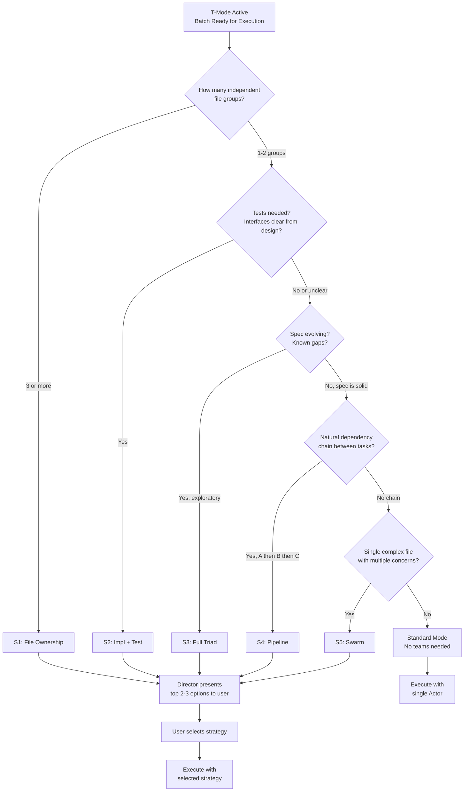
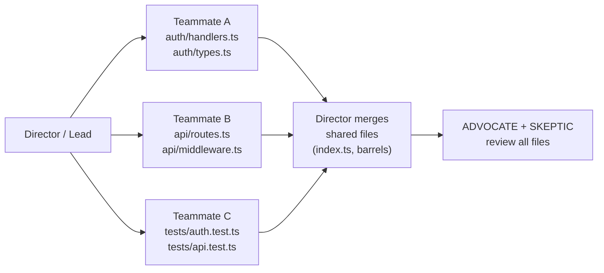
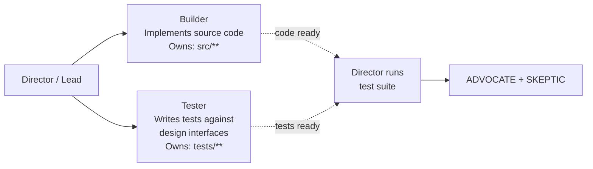
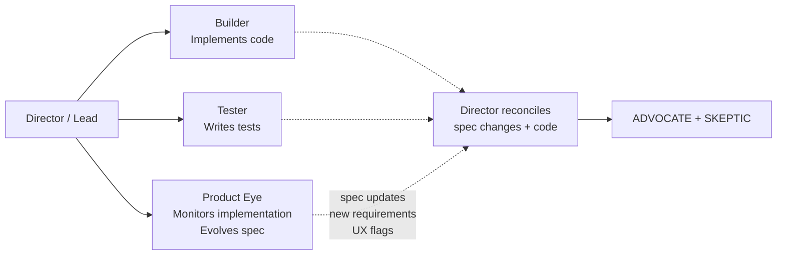
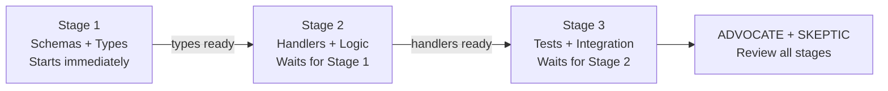
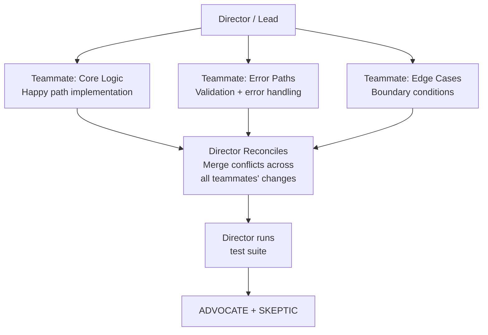
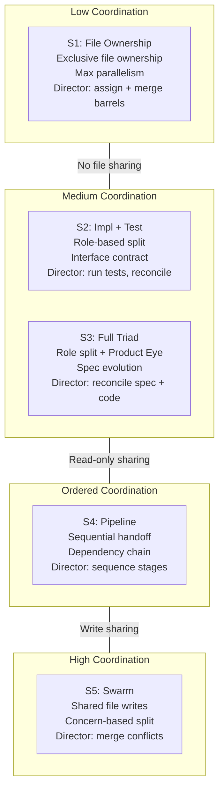

# T-Mode Strategies: Parallel Execution with Agent Teams

## Table of Contents

- [What is T-Mode?](#what-is-t-mode)
- [Strategy Selection Flowchart](#strategy-selection-flowchart)
- [Strategy S1: File Ownership](#strategy-s1-file-ownership)
- [Strategy S2: Impl + Test](#strategy-s2-impl--test)
- [Strategy S3: Full Triad](#strategy-s3-full-triad)
- [Strategy S4: Pipeline](#strategy-s4-pipeline)
- [Strategy S5: Swarm](#strategy-s5-swarm)
- [Strategy Comparison Matrix](#strategy-comparison-matrix)
- [Strategy Taxonomy](#strategy-taxonomy)
- [Not Just Default Claude Code Teams](#not-just-default-claude-code-teams)
- [T-Mode in spec.json](#t-mode-in-specjson)

---

## What is T-Mode?

T-Mode (Team Mode) enables parallel execution within PDLC Autopilot batches using Claude Code's native Agent Teams feature. In standard mode, the Director dispatches one Actor per batch and waits for it to finish before dispatching the next. In T-Mode, the Director spawns multiple teammates within a single batch, dividing work across agents that run concurrently.

### Prerequisites

Agent Teams is a preview feature in Claude Code. To enable it, set the following environment variable **before** launching Claude Code:

```bash
export CLAUDE_CODE_EXPERIMENTAL_AGENT_TEAMS=1
```

The Director checks for this variable at startup. If set, T-Mode is available and the Director announces it:

```
T-Mode active. Parallel teammates enabled.
```

If the variable is not set, the Director falls back to standard single-agent mode with no degradation in functionality.

### Optionality

T-Mode is entirely optional. PDLC Autopilot works fully in standard single-agent mode. Every feature --- spec generation, dual validation, batched execution, fix cycles, session recovery --- functions identically without Agent Teams. T-Mode adds parallelism on top of an already complete system.

When Agent Teams graduates from preview to general availability, the environment variable requirement will be removed. T-Mode will activate automatically when teams are available.

### Claude Code Primitives Used

T-Mode composes four Claude Code primitives:

| Primitive | Purpose in PDLC Autopilot |
|-----------|--------------------------|
| `TeamCreate` | Creates a team with a shared task list for the batch |
| `SendMessage` | Direct messages and broadcasts between teammates and the Director |
| `TaskCreate` / `TaskUpdate` / `TaskList` | Shared coordination --- teammates claim work and report completion |
| `Task` tool with `team_name` and `name` parameters | Spawns agents as members of a named team |

The Director uses these primitives to spawn teammates, assign work, monitor progress, and reconcile results. Teammates communicate through the shared task list and direct messages, not through file-level coordination.

---

## Strategy Selection Flowchart

When T-Mode is active, the Director analyzes each batch before execution and selects a parallelization strategy. The analysis follows a decision tree based on batch characteristics.



### The Decision Steps

1. **Independent file groups**: Count how many sets of files can be modified without cross-dependencies. Three or more groups is the clearest signal for S1 (File Ownership).
2. **Test needs**: If the batch requires both source code and test code, and the design document specifies clear interfaces, S2 (Impl + Test) lets both proceed in parallel.
3. **Spec maturity**: If the spec has known gaps or is expected to evolve during implementation, S3 (Full Triad) adds a Product Eye teammate to evolve the spec alongside the code.
4. **Dependency chain**: If tasks must execute in strict order (schemas before handlers, handlers before tests), S4 (Pipeline) sequences handoffs correctly.
5. **Single complex file**: If many concerns converge on one file, S5 (Swarm) divides by concern. This is the strategy of last resort due to merge overhead.
6. **Small batch**: If none of the above apply and the batch is small with no special needs, standard mode (single Actor) is the right choice. No coordination overhead.

### User Input

Strategy selection is the **one place** the system pauses for user input during T-Mode execution. The Director presents the top 2-3 viable strategies with characteristics (team size, parallelism level, risk profile) and the user picks one. After selection, execution proceeds autonomously with no further prompts.

---

## Strategy S1: File Ownership

**When to use:** The batch contains three or more independent file groups with no shared dependencies between them.

**Team shape:** N teammates, each assigned exclusive ownership of a set of files. Maximum parallelism.



### Rules

1. Each teammate owns files exclusively. No two teammates modify the same file.
2. Shared files (barrel exports like `index.ts`, configuration files like `package.json`) are reserved for the Director/Lead. The Lead updates them after all teammates complete.
3. The Director assigns work via `TaskCreate`. Teammates claim tasks via `TaskUpdate` and report completion the same way.
4. When a teammate finishes its assigned tasks, it marks them as completed in the shared task list and goes idle. The Director monitors the task list for all teammates to reach completion.
5. The Director runs the test suite after merging shared files and before dispatching critics.

### Best For

- Greenfield features with clean module boundaries
- Multiple independent components (auth module, API module, test module)
- Large batches where tasks naturally cluster by directory

### Example

```
tasks.md has 10 tasks across 3 modules:

  auth/ (4 tasks)    --> Teammate A
  api/  (3 tasks)    --> Teammate B
  tests/ (3 tasks)   --> Teammate C

Result: 3 parallel teammates instead of 10 sequential actor calls.
Wall-clock time: ~1/3 of standard mode.
```

### When NOT to Use

If file ownership cannot be cleanly divided --- for example, if most tasks modify a shared utility file --- fall back to S2 or standard mode. Forcing file ownership onto tightly coupled code creates integration problems that cost more than sequential execution.

---

## Strategy S2: Impl + Test

**When to use:** The batch needs both implementation and tests, and the design document specifies clear interfaces or contracts.

**Team shape:** Builder + Tester pair.



### Key Insight

The Tester writes tests against the **design interfaces**, not the implementation. This is the critical differentiator. Because the Tester works from the design document (types, function signatures, expected behaviors), they can write tests in parallel with the Builder without seeing the Builder's code.

This means:
- Tests are written simultaneously with the implementation, not after it
- Interface mismatches surface immediately when the Director runs the test suite
- The Tester acts as an independent verifier of the design contract

### Coordination Protocol

1. The Director sends the design document's interface definitions to both teammates.
2. The Builder implements the source code. It owns all files under `src/` (or equivalent).
3. The Tester writes tests against the design interfaces. It owns all files under `tests/` (or equivalent). It may read source files but must not modify them.
4. Both start simultaneously.
5. When both finish, the Director runs the test suite.
6. If tests fail: the failure likely indicates an interface mismatch between the Builder's implementation and the design spec. The Director reconciles --- either the Builder adjusts its implementation, or the Tester adjusts its expectations based on a justified design change.

### Best For

- Features where the design document clearly specifies interfaces, types, and contracts
- Quality-focused work where catching mismatches early is worth the coordination cost
- Batches where test coverage is a requirement, not optional

### Example

```
Batch: Task CRUD feature (6 tasks)
  Builder: handlers/create.ts, handlers/update.ts, handlers/delete.ts
  Tester:  tests/create.test.ts, tests/update.test.ts, tests/delete.test.ts

Both work from design.md interface:
  createEntity(input: CreateInput): EntityResult
  updateEntity(id: string, patch: Partial<Entity>): EntityResult
  deleteEntity(id: string): void

Builder implements. Tester writes tests against these signatures.
Director runs tests after both complete.
```

---

## Strategy S3: Full Triad

**When to use:** User-facing feature where UX and product decisions matter during implementation, or where the spec is expected to evolve as implementation reveals unknowns.

**Team shape:** Builder + Tester + Product Eye.



### Product Eye Role

The Product Eye is not a code writer. Its responsibilities are:

1. **Monitor implementation progress** via the shared task list as the Builder works.
2. **Read source code** as teammates write it, looking for UX implications.
3. **Flag issues**: accessibility gaps, confusing behaviors, missing error messages, unhandled user-facing states.
4. **Evolve the spec**: update `requirements.md` with discovered requirements (marked as `[DISCOVERED]`), revise `design.md` if implementation reveals better approaches.
5. **Create new tasks** via `TaskCreate` for anything the current batch does not cover but that the Product Eye identifies as necessary.
6. **Communicate findings** to the Director via `SendMessage` for blocking issues that need immediate attention.

### Coordination Protocol

1. The Director sends design interfaces and product context to all three teammates.
2. Builder and Tester start simultaneously (same as S2).
3. Product Eye monitors from the start, reading code and tracking the task list.
4. When all three finish, the Director reconciles: spec changes from Product Eye are reviewed, new tasks are queued for future batches, and the test suite runs.
5. Critics review the full batch including any spec changes.

### Best For

- Features with user-facing UI or UX
- Features where requirements are expected to evolve during implementation ("we'll know it when we see it")
- Exploratory implementations where the spec was written with known gaps

### When NOT to Use

If the spec is solid and fully specified, the Product Eye adds overhead without value. Use S2 (Impl + Test) instead.

---

## Strategy S4: Pipeline

**When to use:** Tasks have strict ordering where each stage depends on the output of the previous one.

**Team shape:** Sequential handoff chain. Low parallelism but correct ordering.



### How It Works

1. Each stage is a separate teammate.
2. Stage 1 starts immediately.
3. Stage N monitors the task list and waits until all Stage N-1 tasks show `completed` before starting.
4. Output from each stage flows as context to the next --- the later teammates read the files created by earlier teammates.
5. The Director monitors the pipeline and ensures handoffs happen correctly.

### Coordination Protocol

```
Teammate A (schemas/types): Start IMMEDIATELY.
  Files owned: schema files, type definitions
  When done: mark tasks completed in task list

Teammate B (handlers/logic): Start when A's tasks show 'completed'.
  Files owned: handler files, business logic
  Read A's files for types/interfaces. DO NOT modify them.
  When done: mark tasks completed

Teammate C (tests/integration): Start when B's tasks show 'completed'.
  Files owned: test files
  Read source files from A and B. DO NOT modify them.
  When done: mark tasks completed

Pipeline: A --> B --> C
```

### Parallelism

S4 has the lowest parallelism of all T-Mode strategies. Its value is not speed --- it is correctness. It guarantees that downstream stages receive stable inputs from upstream stages. Without S4, these tasks would need to run sequentially in standard mode anyway.

However, S4 still provides a structural benefit: each stage teammate has a focused context window (only its owned files plus upstream outputs), which can improve implementation quality for complex dependency chains.

### When NOT to Use

If tasks can be reordered or parallelized, S4 wastes the opportunity for concurrency. Use S1 or S2 instead.

### Best For

- Database migration, then schema types, then handlers, then tests
- API design, then server implementation, then client SDK generation
- Any chain where outputs feed inputs in strict order

---

## Strategy S5: Swarm

**When to use:** Multiple concerns need to be addressed in the same file(s). This is the highest-coordination strategy and should be used as a last resort.

**Team shape:** Multiple teammates working on different concerns within shared files.



### The Reconciliation Problem

S5 is unique among the five strategies: multiple teammates edit the same file from different angles. Their changes **will** conflict. The Director must reconcile after all teammates complete, which involves:

1. Reading all versions of changed files
2. Understanding which changes belong to which concern
3. Merging non-conflicting changes
4. Resolving conflicting changes (e.g., two teammates added different error handling to the same function)
5. Running the test suite to verify the merged result

This makes S5 the highest-overhead strategy. The Director spends significant effort on reconciliation.

### Mitigation

To reduce reconciliation difficulty:

- Each teammate works on **clearly delineated concerns**: happy path vs. error path vs. edge cases, or performance optimization vs. refactoring vs. test coverage.
- Teammates communicate via `SendMessage` if they discover shared state issues that affect other teammates' work.
- The Director provides explicit instructions about which aspects of the code each teammate should focus on and which they should not touch.

### Best For

- Complex single-file refactors where the file cannot be split
- Legacy code modernization (each teammate addresses a different technical debt category)
- Performance optimization (each teammate optimizes a different bottleneck in the same module)

### Last Resort

S5 should only be used when file ownership cannot be cleanly divided. If there is any way to split the work into separate files --- even by extracting functions into new modules first --- S1 (File Ownership) is preferred. The coordination overhead of S5 often negates its parallelism benefits.

---

## Strategy Comparison Matrix

|  | S1: File Ownership | S2: Impl + Test | S3: Full Triad | S4: Pipeline | S5: Swarm |
|---|---|---|---|---|---|
| **Team size** | N (scales with file groups) | 2 | 3 | N (scales with stages) | N (scales with concerns) |
| **File sharing** | None | None | None | Minimal (read-only downstream) | Heavy (shared writes) |
| **Coordination** | Low | Medium | Medium | Low | High |
| **Parallelism** | Maximum | Medium | Medium | None (sequential) | High but costly |
| **Director overhead** | Assign files, merge barrels | Reconcile test failures | Manage Product Eye, reconcile spec | Sequence stages | Merge conflicts |
| **Risk profile** | Integration at boundaries | Interface mismatch | Spec drift mid-batch | Blocked if upstream slow | Merge conflicts |
| **Best signal** | 3+ independent file groups | Tests needed, interfaces clear | Spec evolving, UX matters | Strict A-then-B-then-C | Single complex file |

### Efficiency Comparison

| Scenario | Standard Agents | T-Mode Agents | T-Mode Strategy | Wall-Clock Speedup |
|----------|----------------|---------------|-----------------|-------------------|
| 4 tasks, same file | 3 (1 actor + 2 critics) | 3 (no gain) | Standard | 1x |
| 10 tasks, 3 file groups | 9 (3 batches x 3) | 5 (3 teammates + 2 critics) | S1 | ~3x |
| 8 tasks, impl + tests | 6 (2 batches x 3) | 4 (2 teammates + 2 critics) | S2 | ~2x |
| 6 tasks, dependency chain | 9 (3 sequential batches x 3) | 5 (3 pipeline stages + 2 critics) | S4 | ~1x (correctness, not speed) |

---

## Strategy Taxonomy

The five strategies can be understood along two axes: **file coupling** (do teammates share files?) and **coordination overhead** (how much does the Director manage?).



**Reading the taxonomy:**

- Moving from left to right increases coordination overhead and file coupling.
- S1 has zero file sharing and minimal Director involvement.
- S2 and S3 introduce role-based splits but maintain file exclusivity (Builder owns source, Tester owns tests, Product Eye owns spec).
- S4 introduces read-only sharing (later stages read earlier stages' output).
- S5 introduces write sharing (multiple teammates modify the same files), requiring the Director to merge.

The general principle: **prefer strategies further left**. Move right only when the batch characteristics demand it.

---

## Not Just Default Claude Code Teams

Claude Code provides raw agent spawning primitives --- `TeamCreate`, `SendMessage`, `TaskCreate`, and the `Task` tool with `team_name` and `name` parameters. These are general-purpose building blocks. You can spawn any number of agents and have them communicate freely.

PDLC Autopilot adds structured intelligence on top of these primitives:

### 1. Intelligent Strategy Selection

The Director does not blindly spawn teammates. It analyzes the batch --- file groups, dependency chains, test needs, spec maturity --- and selects the appropriate strategy from S1-S5. The selection follows the flowchart above, weighing multiple signals to pick the pattern that matches the work.

### 2. File Ownership Enforcement

In S1 and S4, no two teammates modify the same file. This is enforced through the teammate request templates: each teammate receives an explicit list of files it owns and instructions not to touch anything outside that list. Shared files (barrel exports, configuration) are reserved for the Director.

### 3. Director Oversight with Consensus-Based Promotion

Teammate output is not automatically accepted. After all teammates complete, the Director dispatches ADVOCATE and SKEPTIC critics to review the combined work. Promotion to "batch complete" requires consensus --- both critics must pass, or the Director must review disagreements and make a call.

### 4. Structured Completion Flow

When a teammate finishes its assigned work, it marks tasks as completed in the shared task list. The Director monitors progress via `TaskList` and proceeds to the merge/integration step only after all teammates report completion. This avoids the default free-form agent communication pattern where completion signals can be missed.

### 5. Graceful Shutdown Sequencing

When all batches complete, the Director sends a `shutdown_request` to all teammates. This ensures clean teardown --- no orphaned agents consuming resources.

### What Users See

Users do not configure teams. They do not write team definitions, assign roles, or manage communication channels. They select a strategy from the options the Director presents (or accept the Director's recommendation), and the rest is autonomous.

```
Director: "I recommend S2 (Impl + Test) for this batch.
           The design specifies clear interfaces, and
           you have 4 tasks needing tests. Alternatives:
           S1 (File Ownership) or Standard mode."

User: "S2"

[Director spawns teammates, manages coordination,
 runs tests, dispatches critics, reports results]
```

---

## T-Mode in spec.json

T-Mode state is persisted in `spec.json` alongside other execution state. This ensures the chosen strategy survives context compaction.

### State Shape

```json
{
  "active_workflow": "pdlc-autopilot",
  "sdlc_state": {
    "started_at": "2026-02-23T10:00:00.000Z",
    "current_phase": "execution",
    "last_batch_completed": 1,
    "t_mode": true,
    "t_strategy": "file-ownership",
    "validation_results": {
      "requirements": "pass",
      "design": "pass",
      "tasks": "pass"
    }
  }
}
```

### Fields

| Field | Type | Description |
|-------|------|-------------|
| `t_mode` | `boolean` | Whether T-Mode was active when the session started. Set on startup based on `CLAUDE_CODE_EXPERIMENTAL_AGENT_TEAMS=1`. |
| `t_strategy` | `string` | The strategy selected by the user. One of: `"file-ownership"`, `"impl-test"`, `"full-triad"`, `"pipeline"`, `"swarm"`. |

### Session Recovery

When a session resumes after context compaction or a new Claude Code session:

1. The Director reads `spec.json` and checks `sdlc_state.t_mode`.
2. If `t_mode` is `true`, the Director checks whether `CLAUDE_CODE_EXPERIMENTAL_AGENT_TEAMS=1` is still set.
3. If the env var is present, T-Mode resumes with the persisted `t_strategy`.
4. If the env var is absent (user launched Claude Code differently), the Director falls back to standard mode and logs a note.

The `t_strategy` field persists the user's choice so it does not need to be re-asked on every session resumption. The strategy applies to all remaining batches unless the user explicitly requests a change.

### Strategy Override

The user can override the strategy for a specific batch by telling the Director:

```
User: "Use S1 for this batch instead."
```

The Director updates `t_strategy` in `spec.json` and applies the new strategy. The override persists for subsequent batches unless changed again.

---

## Appendix: Fallback Rules

T-Mode is aborted and the Director falls back to standard single-Actor mode when:

- File ownership cannot be cleanly divided (S1 attempted but files are too coupled)
- Tasks have data dependencies that do not fit a pipeline ordering (S4 attempted but graph is cyclic)
- Only 1 task exists in the batch (no benefit from parallelism)
- A teammate fails repeatedly (2+ failures on the same task)
- The user explicitly requests standard mode

Fallback is per-batch, not per-session. A later batch can still use T-Mode even if an earlier batch fell back to standard.
