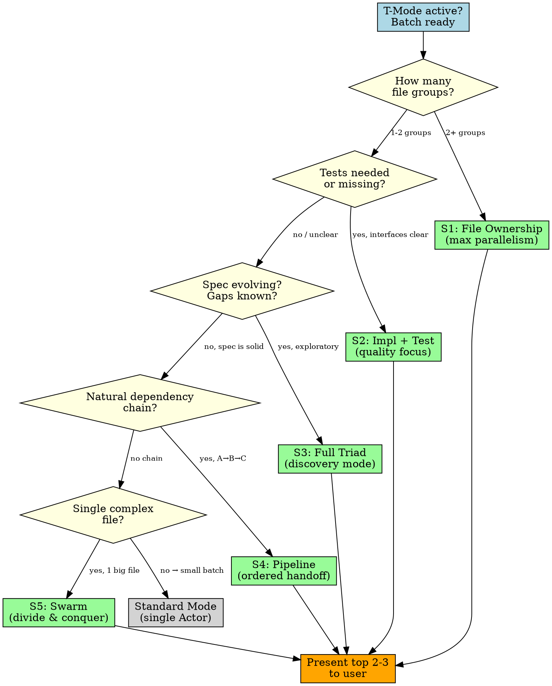

# T-Mode: Agent Teams Integration

**When `CLAUDE_CODE_EXPERIMENTAL_AGENT_TEAMS=1` is set**, the Director can spawn teammates for parallel work within a batch.

## T-Mode Detection

```text
On startup, check for Teams availability:

1. Check env: CLAUDE_CODE_EXPERIMENTAL_AGENT_TEAMS=1
   - If SET → T-Mode available, announce: "T-Mode active. Parallel teammates enabled."
   - If NOT SET → Standard mode, use single Actor subagent per batch

2. Store t_mode in spec.json pdlc_state:
   "t_mode": true           // persists across compaction
   "t_strategy": "..."      // selected strategy name (persists)
```

## Strategy Decision Flowchart



## Strategy Presentation Format

**When T-Mode is active, present options using this format:**

```text
T-Mode Strategy Options for [Batch Name]:

━━━━━━━━━━━━━━━━━━━━━━━━━━━━━━━━━━━━━━━━━━━━━━━━━

[1] S1: File Ownership (Recommended)

    ┌─────────┐  ┌─────────┐  ┌─────────┐
    │ Actor A │  │ Actor B │  │ Actor C │
    │handlers/│  │template/│  │validatr/│
    └────┬────┘  └────┬────┘  └────┬────┘
         └───────────┬┘────────────┘
                     ▼
              ┌────────────┐
              │Lead merges │
              │shared files│
              └──────┬─────┘
                     ▼
              ┌────────────┐
              │  Critics   │
              └────────────┘

    Teammates: 3 (one per module)
    Parallelism: ███████████ HIGH
    Risk: integration at module boundaries
    Best for: independent file groups

━━━━━━━━━━━━━━━━━━━━━━━━━━━━━━━━━━━━━━━━━━━━━━━━━

[2] S2: Impl + Test

    ┌──────────────┐     ┌──────────────┐
    │ Implementer  │     │ Test Writer  │
    │ src/*.ts     │     │ __tests__/*  │
    └──────┬───────┘     └──────┬───────┘
           └────────┬───────────┘
                    ▼
             ┌────────────┐
             │Lead runs   │
             │test suite  │
             └──────┬─────┘
                    ▼
             ┌────────────┐
             │  Critics   │
             └────────────┘

    Teammates: 2 (builder + tester)
    Parallelism: ██████░░░░░ MEDIUM
    Risk: interface mismatch (Lead fixes)
    Best for: TDD flow, catching bugs early

━━━━━━━━━━━━━━━━━━━━━━━━━━━━━━━━━━━━━━━━━━━━━━━━━

[3] S3: Full Triad

    ┌──────────────┐ ┌──────────────┐ ┌──────────────┐
    │ Implementer  │ │ Test Writer  │ │ Product Eye  │
    │ builds code  │ │ writes tests │ │ evolves spec │
    └──────┬───────┘ └──────┬───────┘ └──────┬───────┘
           └────────────────┼────────────────┘
                            ▼
                   ┌──────────────┐
                   │Lead merges + │
                   │reconcile spec│
                   └──────┬───────┘
                          ▼
                   ┌────────────┐
                   │  Critics   │
                   └────────────┘

    Teammates: 3 (builder + tester + product)
    Parallelism: ██████░░░░░ MEDIUM
    Risk: spec drift mid-batch
    Best for: exploratory features, evolving requirements

━━━━━━━━━━━━━━━━━━━━━━━━━━━━━━━━━━━━━━━━━━━━━━━━━

[4] S4: Pipeline

    ┌────────────┐     ┌────────────┐     ┌────────────┐
    │ A: Schemas │────→│ B: Handlers│────→│ C: Tests   │
    │ & types    │     │ & logic    │     │ & integr.  │
    └────────────┘     └────────────┘     └────────────┘
     starts first       waits for A        waits for B

    Teammates: 2-3 (staggered start)
    Parallelism: ████░░░░░░░ LOW (but ordered)
    Risk: blocked if upstream is slow
    Best for: schema→handler→test dependency chains

━━━━━━━━━━━━━━━━━━━━━━━━━━━━━━━━━━━━━━━━━━━━━━━━━

[5] S5: Swarm

    ┌──────────────┐ ┌──────────────┐ ┌──────────────┐
    │ Core Logic   │ │ Error Paths  │ │ Edge Cases   │
    │ happy path   │ │ validation   │ │ boundaries   │
    │ SAME FILES   │ │ SAME FILES   │ │ SAME FILES   │
    └──────┬───────┘ └──────┬───────┘ └──────┬───────┘
           └────────────────┼────────────────┘
                            ▼
                  ┌───────────────────┐
                  │ Lead RECONCILES   │
                  │ (merge conflicts!)│
                  └─────────┬─────────┘
                            ▼
                     ┌────────────┐
                     │  Critics   │
                     └────────────┘

    Teammates: 2-3 (different concerns, same files)
    Parallelism: ██████░░░░░ MEDIUM
    Risk: ⚠️ HIGH merge conflict risk
    Best for: single complex file, major refactoring

━━━━━━━━━━━━━━━━━━━━━━━━━━━━━━━━━━━━━━━━━━━━━━━━━

[0] Standard Mode (no teammates)
    Single Actor → Critics. Safe, sequential, no coordination overhead.

Which strategy? [0-5]
```

**After user selects:**
```text
4. Store choice in spec.json: pdlc_state.t_strategy = "<selected-strategy>"
5. Apply selected strategy for all batches (unless user overrides per-batch)
```

## Strategy Selection Matrix

| Signal | S1 File Own | S2 Impl+Test | S3 Full Triad | S4 Pipeline | S5 Swarm |
|--------|-------------|--------------|---------------|-------------|----------|
| 2+ independent file groups | **best** | ok | ok | ok | no |
| Test suite needed | ok | **best** | **best** | ok | no |
| Spec has gaps/evolving | no | ok | **best** | ok | no |
| Natural task ordering | ok | ok | ok | **best** | no |
| Single complex file | no | no | no | no | **best** |
| Small batch (1-2 tasks) | no | no | no | no | no -> Std |
| Tight file coupling | no | ok | ok | ok | caution |

## File Ownership Rules (applies to S1, partially to S4)

```text
1. NO two teammates touch the same file
2. Shared files (index.ts, barrel exports, package.json) are RESERVED for Lead
3. Lead updates shared files AFTER all teammates complete
4. Each teammate gets a clear list of files they OWN
5. If ownership can't be cleanly divided → consider S2 or Standard mode
```

## T-Mode Actor Protocols

### S1: File Ownership — Teammate Request Template

```text
"I need [N] teammates to implement this batch in parallel.

Teammate A: Implement tasks [1.1, 1.2] in [handlers/].
  Files you OWN: handlers/create-entity.ts, handlers/create-fleeting-note.ts
  DO NOT touch any files outside your ownership.
  Tasks: [paste task descriptions + acceptance criteria]
  Design context: [paste relevant design sections]
  When done, mark your tasks as completed in the task list.

Teammate B: Implement tasks [2.1] in [templates/].
  Files you OWN: templates/generators.ts, templates/index.ts
  [same structure...]

IMPORTANT: Each teammate ONLY modifies files in their ownership list.
Shared files will be updated by me (Lead) after you all finish."
```

### S2: Impl + Test — Teammate Request Template

```text
"I need 2 teammates working in parallel on this batch.

Teammate IMPL: Implement all tasks for this batch.
  Files you OWN: [list all source files]
  Tasks: [paste ALL task descriptions + acceptance criteria]
  Design context: [paste relevant design sections]
  Write the implementation code. DO NOT write tests.
  When done, mark your tasks as completed in the task list.

Teammate TEST: Write test cases for all tasks in this batch.
  Files you OWN: [list all test files, e.g. __tests__/*.test.ts]
  Tasks: Write tests covering these acceptance criteria:
    [paste ALL acceptance criteria from all tasks]
  Design context: [paste interfaces/contracts from design.md]
  Write tests against the DESIGNED interfaces (not the implementation).
  You can read source files but do NOT modify them.
  When done, mark your tasks as completed in the task list.

Both start simultaneously. I (Lead) will run the full test suite
after you both finish and fix any integration gaps."
```

### S3: Impl + Test + Product — Teammate Request Template

```text
"I need 3 teammates working on this batch.

Teammate IMPL: [same as S2 IMPL above]

Teammate TEST: [same as S2 TEST above]

Teammate PRODUCT: Evolve the spec based on implementation discoveries.
  Files you OWN: {spec_dir}/requirements.md, {spec_dir}/design.md
  Your job:
  1. Monitor implementation progress via the task list
  2. Read the source code as teammates write it
  3. Identify edge cases, UX issues, or spec gaps
  4. Update requirements.md with discovered requirements (mark as [DISCOVERED])
  5. Update design.md with revised designs if needed
  6. Create new tasks via TaskCreate for anything the current batch doesn't cover
  7. Flag blocking issues to me (Lead) immediately
  When done, summarize all spec changes in the task list.

IMPL and TEST start immediately. PRODUCT monitors and evolves.
I (Lead) will reconcile spec changes before the next batch."
```

### S4: Pipeline — Teammate Request Template

```text
"I need [N] teammates working in a pipeline for this batch.

Teammate A (schemas/types): Start IMMEDIATELY.
  Files you OWN: [schema/type files]
  Tasks: [schema/type tasks]
  When done, mark tasks completed. Teammate B is waiting on your interfaces.

Teammate B (handlers/logic): Start when Teammate A's tasks show 'completed'.
  Files you OWN: [handler/logic files]
  Tasks: [handler tasks]
  Read Teammate A's files for types/interfaces. DO NOT modify them.
  When done, mark tasks completed.

Teammate C (tests/integration): Start when Teammate B's tasks show 'completed'.
  Files you OWN: [test files]
  Tasks: [test tasks]
  Read source files but DO NOT modify them.
  When done, mark tasks completed.

Pipeline: A → B → C. Each waits for the previous to finish.
I (Lead) will merge shared files and run the full suite after C completes."
```

## Teammate Coordination (all strategies)

```text
1. Lead creates TaskCreate for each task (if not already created)
2. Lead requests teammates per selected strategy template
3. Teammates work per their assigned role
4. Teammates use TaskUpdate to mark tasks completed
5. Lead monitors TaskList for all teammate tasks → completed
6. Lead updates shared files (barrel exports, index.ts, etc.)
7. Lead runs full test suite to verify integration
8. Lead dispatches Critics (ADVOCATE + SKEPTIC) on ALL changed files
```

## Lead Post-Teammate Checklist

```text
After all teammates complete:
  1. TaskList() → verify all teammate tasks are "completed"
  2. If S3 (Product): review spec changes, reconcile with current batch
  3. Read shared files that may need updates (index.ts, barrel exports)
  4. Update shared files to integrate teammate work
  5. Run test suite: npm test / pytest / etc.
  6. If tests fail: Lead fixes integration issues directly
  7. Dispatch Critics on the FULL batch (all files, all teammates' work)
```

## Fallback: When to Abort T-Mode

```text
Abort T-Mode and fall back to standard Actor if:
  - File ownership can't be cleanly divided (S1)
  - Tasks have data dependencies that don't fit a pipeline (S4)
  - Only 1 task in the batch
  - Teammate fails repeatedly (2+ failures on same task)
  - User requests Standard mode
```

## T-Mode Batch Analysis

```text
Standard mode: Group tasks by file → one Actor per batch
T-Mode:        Group tasks by file → analyze → select strategy → spawn teammates

For each batch, determine:
  1. How many independent file groups? (→ S1 if 2+)
  2. Are tests needed/missing? (→ S2 or S3)
  3. Is the spec evolving? (→ S3)
  4. Natural dependency chain? (→ S4)
  5. Single complex file? (→ S5)
  6. Only 1 task or tightly coupled? (→ Standard)

Present viable options to user at Step 2.5 (see Strategy Selection above).
```
